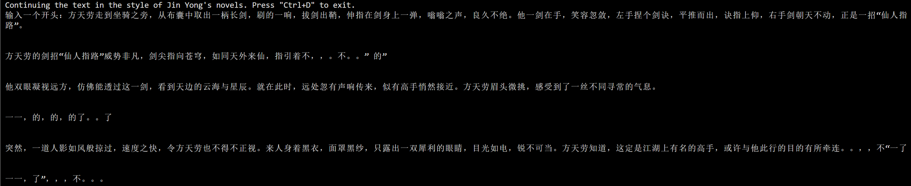

# JinYong-GPT

一个基于 MindSpore 框架和昇腾 910 平台训练实现的小型 GPT 模型，能够在给定开头的情况下实现金庸风格的小说续写。

## 安装

项目依赖：

- [MindSpore](https://www.mindspore.cn/install/)
- numpy

代码结构：

```
JinYong-GPT
├─ data 		// 金庸小说数据集
├─ dataset 		// MindRecord 格式数据集文件
├─ inference.py 	// 推理脚本
├─ train.py 		// 模型训练脚本
├─ src
│ ├─ dataset.py 	// 训练数据集生成脚本
│ ├─ gpt.py 		// 模型主体代码
│ ├─ pre_process.py     // 数据预处理脚本
│ └─ utils.py 		// 工具和 Config 类
...
```

## 运行

1. 选择一本（或多本）金庸小说作为建模对象，运行 `src/pre_process.py` 脚本进行预处理，生成 MindRecord 格式数据集。注意记录序列长度和词表大小，并将训练和推理脚本中的代码修改一致；

2. 执行训练脚本 `train.py` 训练模型；
3. 执行推理脚本，加载模型 `checkpoint` ，测试续写效果；
4. 导出 OM 模型在昇腾 310 上进行离线推理。

## 推理示例



上述示例存在过拟合现象，当生成的内容遇到原小说中简单的、高频的字词时会变得断断续续。这可能是训练不足或数据规模与模型的复杂度不匹配导致的，可以适当调参或者减小模型大小。
